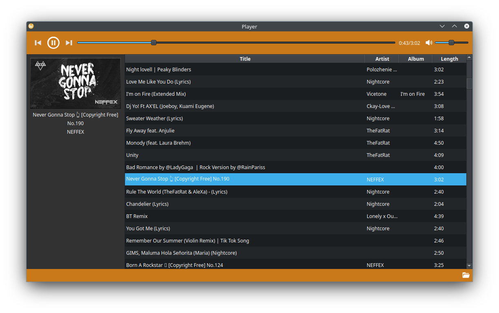

# CustomPlayer

This project is distributed under the GNU GPL-3.0 license.
For details, please refer to the [LICENSE](./LICENSE) file.

# Used Libraries
- [Qt6](https://github.com/qt/qtbase)
- [SQLiteCpp](https://github.com/SRombauts/SQLiteCpp)
- [libsndfile](https://github.com/libsndfile/libsndfile)
- [libpipewire](https://pipewire.org/)
- [taglib](https://github.com/taglib/taglib)

## Third-Party Components Licenses
This project uses third-party components such as [TagLib](https://github.com/taglib/taglib) ([TagLib License](./TAGLIB_LICENSE)) which have their own respective licenses.
Please review the relevant licenses for these components.

This project uses icons from multiple third-party icon packs. The icons used in this project are from the following icon packs and are licensed under their respective licenses:
- [IonIcons](https://github.com/ionic-team/ionicons) - Ben Sperry, [MIT License](./IonIcons_LICENSE)
- [Zondicons](https://github.com/dukestreetstudio/zondicons) - Steve Schoger, [MIT License](./Zondicons_LICENSE)
- [css.gg](https://github.com/astrit/css.gg) - Astrit, [MIT License](./css.gg_LICENSE)
- [MaterialDesign](https://github.com/Templarian/MaterialDesign) - Pictogrammers, [Apache 2.0 License](./MaterialDesign_LICENSE)
